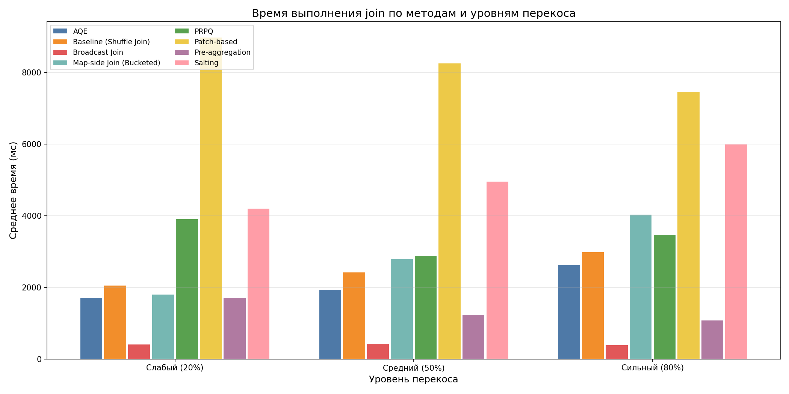
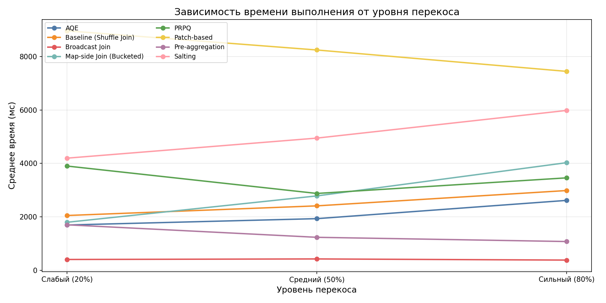
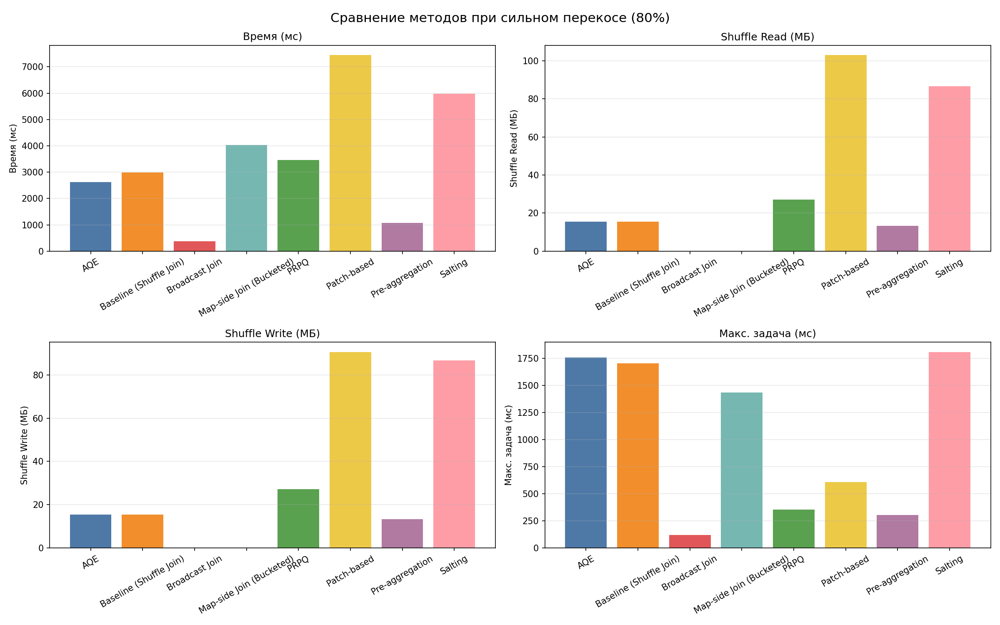
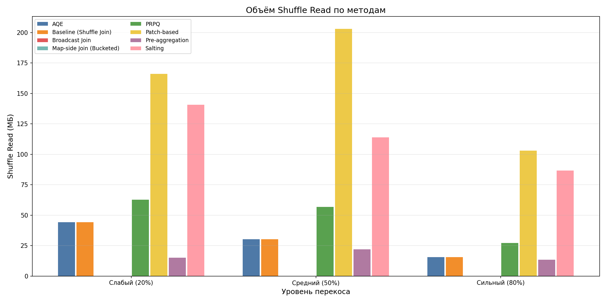
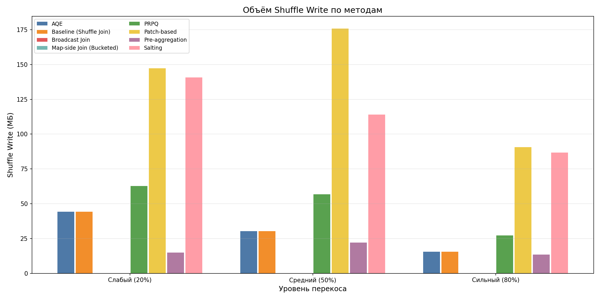
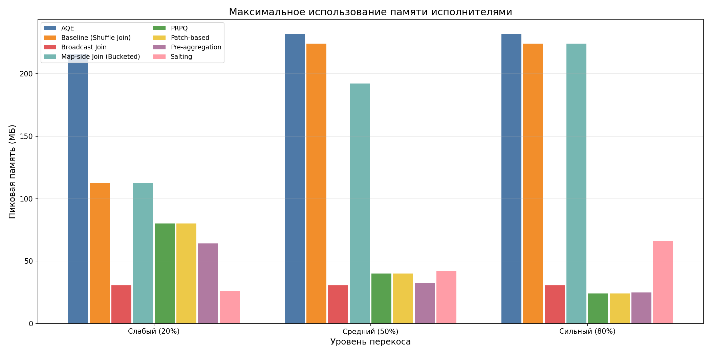
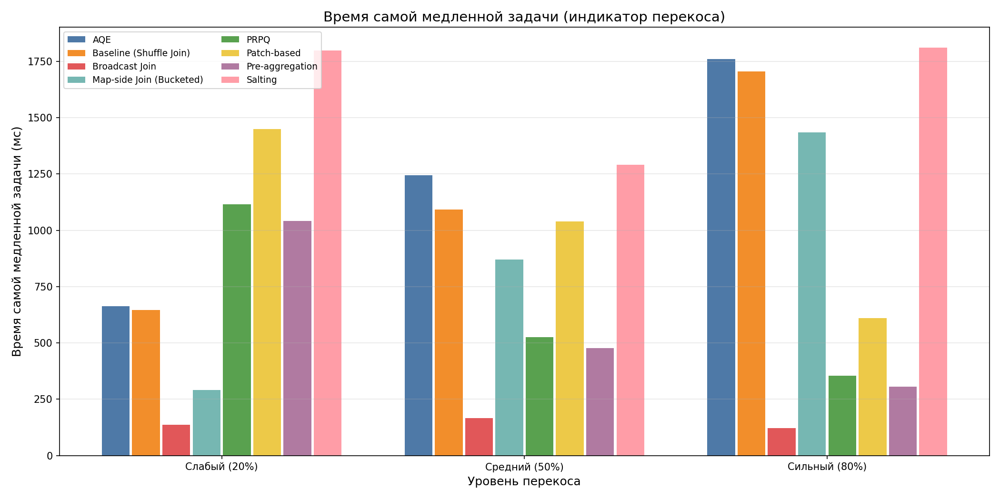

# DataSkewAnalysis

Сравнительный анализ 7 методов решения проблемы перекоса данных (data skew) при выполнении join-операций в Apache Spark.

## Стек технологий

- Java 17
- Apache Spark 3.5.0 (Scala 2.12)
- Maven
- Docker Compose (кластер: 1 master + 3 worker)

## Сборка и запуск

```bash
# Сборка
mvn clean package

# Поднять кластер (master + 3 worker × 2 cores × 2 GB)
docker-compose up -d

# Запуск всех бенчмарков (все 7 методов × 3 уровня перекоса)
docker exec spark-master /opt/spark/bin/spark-submit \
  --master spark://spark-master:7077 \
  --driver-memory 1g \
  --executor-memory 1g \
  --executor-cores 2 \
  --total-executor-cores 6 \
  --class com.vanmors.dataskew.Main \
  /opt/spark-apps/DataSkewAnalysis-1.0-SNAPSHOT.jar

# Результаты сохраняются в /tmp/benchmark_results.csv внутри контейнера
docker cp spark-master:/tmp/benchmark_results.csv ./benchmark_results.csv

# Построить графики (требует pandas, matplotlib)
python3 plot_results.py benchmark_results.csv ./plots

# Остановить кластер
docker-compose down
```

## Реализованные методы

| # | Метод                      | Класс                                          | Описание                                                                                                                                                                                                        |
|---|----------------------------|------------------------------------------------|-----------------------------------------------------------------------------------------------------------------------------------------------------------------------------------------------------------------|
| 1 | Adaptive Query Execution   | `AQE.AQEBenchmark`                             | Встроенная оптимизация Spark: автоматическое разбиение скошенных партиций при join. Настраивается через `spark.sql.adaptive.*`                                                                                  |
| 2 | Salting                    | `salting.SaltingBenchmark`                     | Добавление случайной соли к ключу join в большой таблице и размножение малой таблицы по всем значениям соли. Распределяет горячий ключ по нескольким партициям                                                  |
| 3 | Broadcast Join             | `broadcast.BroadcastJoinBenchmark`             | Рассылка малой таблицы на все исполнители через `broadcast()`. Join выполняется локально без shuffle                                                                                                            |
| 4 | Pre-aggregation            | `preaggregation.PreAggregationBenchmark`       | Предварительная агрегация (`groupBy` + `agg`) большой таблицы по ключу join перед выполнением join. Сокращает объём скошенных данных                                                                            |
| 5 | Map-side Join (Bucketed)   | `MapSideJoin.MapSideJoinBenchmark`             | Обе таблицы записываются в Hive через `bucketBy(200, "user_id").sortBy("user_id").saveAsTable()`. Метаданные о бакетировании хранятся в Derby Metastore. Spark исключает `Exchange` из плана - join без shuffle |
| 6 | PRPQ                       | `PRPQ.PRPQBenchmark`                           | Partial Redistribution & Partial Query (Cheng et al., 2014). Тяжёлые ключи обрабатываются через broadcast join, остальные - через обычный shuffle join, результаты объединяются через union                     |
| 7 | Patch-based Repartitioning | `PatchBasedRepartitioning.PatchBasedBenchmark` | На основе работы Kassela E., Konstantinou I., Koziris N. (2025). Скошенные ключи разбиваются на патчи фиксированного размера, малая таблица реплицируется только для скошенных ключей, join по составному ключу `(user_id, patch_id)`   |

Полное имя класса: `com.vanmors.dataskew.<класс из таблицы>`.

## Генерация данных

Класс `DataGenerator.java` генерирует два синтетических набора данных:

| Таблица          | Размер             | Распределение                       | Поля                                                         |
|------------------|--------------------|-------------------------------------|--------------------------------------------------------------|
| **users**        | 1 000 000 записей  | Равномерное                         | `user_id` (long), `name` (string)                            |
| **transactions** | 10 000 000 записей | Контролируемый перекос по `user_id` | `transaction_id` (long), `user_id` (long), `amount` (double) |

Параметры перекоса:

- **Горячий ключ:** `user_id = 42`
- Бенчмарк прогоняется при **трёх уровнях перекоса**:

| Уровень | Константа | Доля горячего ключа | Строк на `user_id=42` |
|---------|-----------|--------------------:|----------------------:|
| Слабый  | `WEAK`    |                 20% |            ~2 000 000 |
| Средний | `MEDIUM`  |                 50% |            ~5 000 000 |
| Сильный | `STRONG`  |                 80% |            ~8 000 000 |

Оставшиеся строки распределены равномерно по 999 999 прочим пользователям.

## Методология бенчмарка

`Main.java` - единый оркестратор. SparkSession создаётся **один раз** для всей серии.

Для каждого уровня перекоса (`WEAK` -> `MEDIUM` -> `STRONG`):

1. Генерирует и кэширует данные (transactions + users) **один раз** - все 7 методов внутри одного уровня работают на
   одних и тех же данных.
2. Запускает **baseline** - обычный shuffle join без оптимизаций.
3. Запускает каждый из 7 методов.
4. Освобождает кэш (`unpersist`), переходит к следующему уровню перекоса.

Каждый замер (baseline и все методы):

- **1 warmup-прогон** (прогрев JVM и JIT)
- **3 измерительных прогона**, результаты усредняются

Метрики собираются через кастомный `SparkListener` (`BenchmarkUtils.MetricsListener`):

| Метрика                      | Описание                                                    |
|------------------------------|-------------------------------------------------------------|
| Время выполнения             | avg / min / max по 3 прогонам (мс)                          |
| Shuffle Read                 | средний суммарный объём прочитанных shuffle-данных (байт)   |
| Shuffle Write                | средний суммарный объём записанных shuffle-данных (байт)    |
| Peak Execution Memory        | максимальная пиковая память среди всех задач (байт)         |
| Время самой медленной задачи | avg `executorRunTime` по максимальной задаче в прогоне (мс) |

Все результаты записываются в `BenchmarkResult` и сохраняются в `/tmp/benchmark_results.csv`.

## Структура проекта

```
src/main/java/com/vanmors/dataskew/
    Main.java                  - запуск всех бенчмарков последовательно
    DataGenerator.java         - генератор синтетических данных с перекосом
    BenchmarkUtils.java        - сбор метрик, warmup, усреднение, создание SparkSession
    AQE/                       - Adaptive Query Execution
    salting/                   - Salting
    broadcast/                 - Broadcast Join
    preaggregation/            - Pre-aggregation (map-side reduce)
    MapSideJoin/               - Co-partitioned Join
    PRPQ/                      - Partial Redistribution & Partial Query
    PatchBasedRepartitioning/  - Patch-based Repartitioning
```

## Отклонения реализаций от теоретических алгоритмов

В ряде случаев реализация намеренно отклоняется от оригинального описания алгоритма. Причины и последствия каждого
отклонения задокументированы ниже.

---

### Patch-based Repartitioning: `rand()` вместо детерминированной нумерации строк

**Оригинальный алгоритм** (Kassela E., Konstantinou I., Koziris N., 2025;
DOI: [10.1109/ACCESS.2025.3547623](https://doi.org/10.1109/ACCESS.2025.3547623)).
Строки скошенного ключа нумеруются детерминированно (1, 2, 3, …) и делятся на патчи фиксированного размера:
`patch_id = floor((row_number - 1) / PATCH_SIZE)`. Такое разбиение гарантирует равные по размеру патчи и
воспроизводимость при повторном запуске.

**Причина отклонения.**
Детерминированная нумерация через `row_number().over(Window.partitionBy("user_id").orderBy("transaction_id"))` при 80%
перекосе (8M строк одного ключа) собирает **все 8M строк** в одну партицию для глобальной сортировки. На кластере с 2 GB
RAM на исполнитель это вызывает OOM или выплёскивание сортировки на диск, многократно увеличивая время выполнения.

**Реализованный вариант.**
`patch_id` назначается через `floor(rand() * num_patches)` - каждая строка получает случайный номер патча, равномерно
распределённый по `[0, num_patches)`. Размер патча не фиксирован детерминированно, но в среднем соответствует
`PATCH_SIZE` за счёт закона больших чисел.

**Последствия.**

- Равномерность распределения строк по патчам достигается статистически, а не гарантируется точно - небольшой дисбаланс
  между патчами возможен.
- Воспроизводимость нумерации не обеспечивается (при повторном запуске строки попадут в другие патчи, что допустимо -
  join всё равно корректен).
- По сути, для скошенных ключей реализация эквивалентна salting с числом бакетов `num_patches`, но применяется только к
  скошенным ключам, тогда как обычные ключи сохраняют `patch_id = 0`.
- Семантически join остаётся корректным: каждая транзакция попадает ровно в один патч, а таблица users реплицирована для
  всех патчей данного ключа через `explode(sequence(...))`.

> **Замечание для отчёта:** реализованный вариант следует трактовать как *randomised patch-based repartitioning* -
> вероятностное приближение оригинального детерминированного алгоритма, обоснованное ограничениями памяти тестового
> кластера.

---

**Среда выполнения:** Docker Spark 3.5.0, 1 master + 3 worker (2 cores × 2 GB RAM = 6 cores / 6 GB суммарно),
aarch64/linuxkit.
**Данные:** 10 000 000 transactions, 1 000 000 users, горячий ключ `user_id = 42`.
**Замеры:** 1 warmup + 3 measured runs, усреднение. Результаты в файле `benchmark_results.csv`.
**Графики:** директория `plots/` (7 PNG).

### Сводная таблица

#### Слабый перекос - WEAK (20% строк на горячий ключ, ~2M строк)

| Метод                    | Время avg / min / max (мс) | Shuffle R | Shuffle W | Peak Mem | Макс. задача (мс) |
|--------------------------|---------------------------:|----------:|----------:|---------:|------------------:|
| Baseline (Shuffle Join)  |         2050 / 1894 / 2196 |   44,2 MB |   44,2 MB | 112,2 MB |               645 |
| **Broadcast Join**       |        **403** / 363 / 448 |     118 B |     118 B |  30,5 MB |           **136** |
| Pre-aggregation          |         1701 / 1552 / 1864 |   15,0 MB |   15,0 MB |  64,0 MB |              1042 |
| Map-side Join (Bucketed) |         1796 / 1557 / 1961 |   11,5 KB |   11,5 KB | 112,2 MB |               291 |
| AQE                      |         1694 / 1536 / 1862 |   44,2 MB |   44,2 MB | 216,0 MB |               663 |
| PRPQ                     |         3902 / 3520 / 4465 |   62,6 MB |   62,6 MB |  80,0 MB |              1115 |
| Salting                  |         4198 / 3932 / 4710 |  140,7 MB |  140,7 MB |  26,0 MB |              1799 |
| Patch-based              |         8967 / 8869 / 9060 |  166,1 MB |  147,2 MB |  80,0 MB |              1449 |

#### Средний перекос - MEDIUM (50% строк на горячий ключ, ~5M строк)

| Метод                    | Время avg / min / max (мс) | Shuffle R | Shuffle W | Peak Mem | Макс. задача (мс) |
|--------------------------|---------------------------:|----------:|----------:|---------:|------------------:|
| Baseline (Shuffle Join)  |         2411 / 2095 / 2638 |   30,3 MB |   30,3 MB | 224,2 MB |              1093 |
| **Broadcast Join**       |        **423** / 357 / 508 |     354 B |     354 B |  30,5 MB |           **166** |
| **Pre-aggregation**      |     **1233** / 1134 / 1371 |   22,1 MB |   22,1 MB |  32,0 MB |               476 |
| AQE                      |         1932 / 1639 / 2211 |   30,3 MB |   30,3 MB | 232,0 MB |              1244 |
| PRPQ                     |         2876 / 2702 / 3186 |   56,9 MB |   56,9 MB |  40,0 MB |               526 |
| Map-side Join (Bucketed) |         2784 / 2654 / 2912 |   11,5 KB |   11,5 KB | 192,2 MB |               871 |
| Salting                  |         4949 / 4109 / 5453 |  114,0 MB |  114,0 MB |  42,0 MB |              1291 |
| Patch-based              |        8249 / 6886 / 10795 |  203,0 MB |  175,8 MB |  40,0 MB |              1040 |

#### Сильный перекос - STRONG (80% строк на горячий ключ, ~8M строк)

| Метод                    | Время avg / min / max (мс) | Shuffle R | Shuffle W |    Peak Mem | Макс. задача (мс) |
|--------------------------|---------------------------:|----------:|----------:|------------:|------------------:|
| Baseline (Shuffle Join)  |         2985 / 2755 / 3341 |   15,5 MB |   15,5 MB |    224,2 MB |              1704 |
| **Broadcast Join**       |        **380** / 331 / 420 |     354 B |     354 B | **30,5 MB** |           **121** |
| **Pre-aggregation**      |      **1075** / 949 / 1160 |   13,4 MB |   13,4 MB |     24,7 MB |               305 |
| AQE                      |         2616 / 2485 / 2783 |   15,5 MB |   15,5 MB |    232,0 MB |              1760 |
| PRPQ                     |         3460 / 2893 / 4002 |   27,1 MB |   27,1 MB |     24,0 MB |               354 |
| Map-side Join (Bucketed) |         4029 / 3547 / 4607 |   11,5 KB |   11,5 KB |    224,2 MB |              1434 |
| Salting                  |         5985 / 5355 / 6964 |   86,7 MB |   86,7 MB |     66,0 MB |              1810 |
| Patch-based              |         7448 / 7110 / 7880 |  103,0 MB |   90,6 MB |     24,1 MB |               610 |

### Графики

#### Время выполнения по методам и уровням перекоса



#### Тренд времени в зависимости от уровня перекоса



#### Сводный дашборд - 4 метрики при сильном перекосе (STRONG 80%)



#### Shuffle Read



#### Shuffle Write



#### Пиковая память исполнителей



#### Время самой медленной задачи (индикатор вычислительного дисбаланса)



### Рейтинг методов по уровням перекоса

| Место | WEAK (20%)           | MEDIUM (50%)             | STRONG (80%)             |
|-------|----------------------|--------------------------|--------------------------|
| 1     | **Broadcast** ×5,1   | **Broadcast** ×5,7       | **Broadcast** ×7,9       |
| 2     | AQE ×1,2             | **Pre-aggregation** ×2,0 | **Pre-aggregation** ×2,8 |
| 3     | Pre-aggregation ×1,2 | AQE ×1,2                 | AQE ×1,1                 |
| 4     | Map-side ×1,1        | Map-side ×0,9            | PRPQ ×0,9                |
| 5     | Baseline             | PRPQ ×0,8                | Baseline                 |
| 6     | PRPQ ×0,5            | Baseline                 | Map-side ×0,7            |
| 7     | Salting ×0,5         | Salting ×0,5             | Salting ×0,5             |
| 8     | Patch-based ×0,2     | Patch-based ×0,3         | Patch-based ×0,4         |

### Анализ результатов

#### 1. Broadcast Join - абсолютный лидер на всех уровнях

**380–423 мс** при любом перекосе (×5,1–7,9 vs baseline). Shuffle фактически нулевой (118–354 B - только координационный
трафик), peak memory 30,5 MB. Таблица users (1M строк, ~23 MB) рассылается каждому executor-у и join выполняется
локально. Перекос данных не влияет на время выполнения: все executor-ы обрабатывают свою часть transactions независимо.

**Ограничение:** требует, чтобы малая таблица помещалась в память каждого executor-а. При росте users до десятков ГБ -
неприменим.

#### 2. Pre-aggregation - ускоряется при росте перекоса

При слабом перекосе: **1701 мс** (×1,2); при сильном: **1075 мс** (×2,8). Это нелинейный, противоинтуитивный эффект: чем
сильнее перекос, тем больше строк сворачивается в одну агрегированную запись для `user_id=42`, тем меньше данных
поступает на join. При 80% перекосе 8M строк превращаются в 1 строку с агрегатами - объём join-а сокращается
многократно.

Shuffle снижается по той же причине: при STRONG - 13,4 MB против 44,2 MB у baseline.

#### 3. AQE - умеренное ускорение, устойчивое поведение

При WEAK: **1694 мс** (×1,2 vs baseline 2050 мс). При MEDIUM и STRONG: даёт 20–13% ускорения, не деградирует. Shuffle
остаётся на уровне baseline (Exchange выполняется, но skew join handler разбивает скошенную
партицию).

#### 4. Map-side Join (Bucketed) - деградация при сильном перекосе

При WEAK: **1796 мс** (×1,1 vs baseline) - небольшое преимущество. При MEDIUM: **2784 мс** (×0,9) - паритет. При STRONG:
**4029 мс** (×0,7) - **медленнее baseline**.

Bucketed join исключает shuffle между узлами (Shuffle Read = 11,5 KB при всех уровнях - подтверждено `explain()` без
`Exchange`), но не устраняет внутрипартиционный дисбаланс. При 80% перекосе один бакет получает ~8M строк с
`user_id=42`. Этот бакет обрабатывается одним тредом одного executor-а, вся локальная сортировка ложится на него. Время
самой медленной задачи: 1434 мс при STRONG против 291 мс при WEAK. Bucketed join эффективно устраняет *network* skew, но
не *compute* skew.

#### 5. PRPQ - улучшается с ростом перекоса

При WEAK: **3902 мс** (×0,5) - значительно хуже baseline. При MEDIUM: **2876 мс** (×0,8). При STRONG: **3460 мс** (
×0,9).

Чем сильнее перекос, тем больший процент данных обрабатывается через broadcast join (без shuffle), тем эффективнее
алгоритм. При STRONG: 80% строк уходят в broadcast-ветку, shuffle выполняется только для 20% - Shuffle Read снижается до
27,1 MB против 15,5 MB у baseline (почти паритет). Дополнительные стадии (группировка heavy hitters, split, union)
создают overhead, который при 6 cores не полностью компенсируется выигрышем от broadcast.

#### 6. Salting - стабильно хуже baseline на всех уровнях

**4198–5985 мс** (×0,5 при любом перекосе). Размножение users в 10× создаёт 10M строк users, shuffle растёт в 3–6× по
сравнению с baseline. При STRONG peak memory снижается (66 MB vs 224 MB у baseline) - горячий ключ распределился. Но
общее время растёт с перекосом, так как при большей доле горячего ключа каждый из 10 salt-бакетов получает больше
данных.

#### 7. Patch-based - наибольший overhead, но снижается при сильном перекосе

**7448–8967 мс** (×0,2–0,4). Самый дорогой алгоритм на 6 cores. Однако есть любопытная динамика: при STRONG перекосе
время **меньше**, чем при WEAK (7448 vs 8967 мс), а shuffle Read/Write тоже снижаются (103 MB vs 166 MB). Это
объясняется тем, что при более высоком перекосе число патчей для горячего ключа растёт, но параллелизм внутри
патч-join-а также растёт, что частично компенсирует overhead. Метод асимптотически выгоднее при кластерах с большим
числом исполнителей.

### Предварительные выводы

**1. Какой метод показал наилучший результат при слабом / среднем / сильном перекосе?**

При всех трёх уровнях перекоса - **Broadcast Join** (×5,1 / ×5,7 / ×7,9). Второе место при среднем и сильном перекосе -
**Pre-aggregation** (×2,0 / ×2,8, при условии совместимости семантики запроса с агрегацией). При слабом перекосе второе
место делят **AQE** и **Pre-aggregation** (~×1,2).

**2. Какой гибридный подход даёт наибольшее сокращение времени?**

Гибридные подходы в данном эксперименте не тестировались (оставлены для следующего этапа). Теоретически: комбинация *
*Broadcast + AQE** (broadcast для малой таблицы + AQE для адаптации к данным) или **PRPQ + Broadcast** (PRPQ уже
использует broadcast для тяжёлых ключей) - наиболее перспективны.

## Ограничения данного анализа

### 1. Масштаб кластера

3 worker × 2 cores × 2 GB - это минимальный кластер. Методы Salting, PRPQ и Patch-based проектировались для кластеров с
десятками-сотнями executor-ов. На 6 cores overhead от дополнительных стадий и shuffle не окупается параллелизмом.

**Что это меняет:**

- На 6 cores задачи конкурируют за ресурсы; на 60 cores дополнительные задачи выполняются параллельно
- Сетевой shuffle между 3 контейнерами в bridge-сети значительно быстрее, чем между физическими узлами в реальном
  кластере
- Эффект straggler-а при 3 worker-ах слабее, чем при 30 - один медленный executor из 3 блокирует 33% мощности, из 30 -
  только 3%

**Решение:** масштабировать до 10–30 worker-ов или использовать cloud-кластер (EMR, Dataproc).

### 2. Масштаб данных

10M строк - сравнительно небольшой объём для Spark. Overhead от координации задач (планировщик, сериализация, сетевые
handshake) составляет значительную долю общего времени.

При миллиардах строк:

- Стоимость shuffle станет доминирующей - методы, избегающие shuffle (Broadcast, Co-partitioned), покажут ещё больший
  выигрыш
- Straggler-эффект станет критичным - один executor с 70% данных будет работать часами
- Методы Salting, PRPQ, Patch-based начнут окупать свой overhead

### 3. Модель перекоса

Текущая модель (один ключ = 70% данных) - крайний случай. В реальных данных:

- Несколько горячих ключей (Zipf/степенное распределение)
- Меньшая степень перекоса (5–20% на топ-ключи)
- Перекос может меняться во времени

PRPQ и Patch-based рассчитаны на множество горячих ключей - при одном ключе broadcast join для него тривиален. С
Zipf-распределением эти алгоритмы покажут свои преимущества.

### 4. Map-side Join: стоимость записи bucketed-таблиц

Запись таблиц с `bucketBy` + `sortBy` (`saveAsTable`) **не включена** в замер - засекается только время join-а. Эта
операция требует full shuffle и записи на диск. В production-сценарии bucketing выполняется один раз при ETL, поэтому
его стоимость амортизируется по всем последующим запросам.

### 5. Pre-aggregation: несопоставимость результатов

Pre-aggregation возвращает **~950K строк** вместо 10M - это агрегированный результат, а не полный join. Прямое сравнение
времени с baseline (10M строк) некорректно, т.к. задачи имеют разную семантику и разный объём результата.

### 6. AQE coalesce на малом кластере

AQE показал деградацию из-за агрессивного coalesce (209 -> 15 задач). На малом кластере (6 cores) укрупнение задач
снижает параллелизм. Проблема не в AQE, а следствие масштаба: настройки AQE оптимизированы для кластеров с сотнями
cores, где сотни мелких задач создают overhead планировщика.

## Дополнительный эксперимент: multi-skew (несколько горячих ключей)

### Мотивация

В основном эксперименте (раздел 3 «Ограничения», п. 3 «Модель перекоса») модель скоса — **один** ключ концентрирует
20/50/80% строк. Это крайний случай, на котором PRPQ и особенно Patch-based показали неинтуитивно плохие результаты:

- **Patch-based** концептуально является «умным salting» — солит только скошенные ключи и подбирает число патчей
  per-key на основе `ceil(cnt / PATCH_SIZE)`. По теории Kassela et al. (2025) он должен опережать обычный Salting за счёт
  адаптивности. Фактически на single-skew данных он медленнее Salting в 1,5–2 раза (8967 vs 4198 мс при WEAK).
- **PRPQ** (Cheng et al., 2014) задуман для случая, когда есть **несколько** heavy hitters. При одном горячем ключе
  алгоритм вырождается в «broadcast для одного ключа + shuffle для всего остального», что делает оверхед на разделение
  и union неоправданным.

Возникла гипотеза: оба адаптивных метода (Patch-based и PRPQ) проектировались для распределений с **несколькими**
скошенными ключами **разной** частоты — именно там их адаптивность должна давать выигрыш над «слепым» Salting с
фиксированным числом солей.

Дополнительно проверялась чувствительность Patch-based к параметру `PATCH_SIZE`: оригинальная реализация использует
`PATCH_SIZE = 50_000`, что для горячего ключа на 7M строк даёт 140 патчей — избыточно много по сравнению с
`NUM_SALT_BUCKETS = 10` у Salting. Хотелось проверить, не улучшит ли результат увеличение `PATCH_SIZE`.

### Параметры эксперимента

5 горячих ключей с плавно убывающей частотой; общая доля скошенных строк совпадает с основным экспериментом
(0.20 / 0.50 / 0.80), но размазана по нескольким ключам:

| Уровень | user_id=42 | user_id=7 | user_id=13 | user_id=99 | user_id=256 |    Σ |
|---------|-----------:|----------:|-----------:|-----------:|------------:|-----:|
| WEAK    |         7% |        5% |         4% |         2% |          2% | 0.20 |
| MEDIUM  |        18% |       13% |        10% |         6% |          3% | 0.50 |
| STRONG  |        30% |       20% |        15% |        10% |          5% | 0.80 |

Оставшиеся строки распределены равномерно по 1M прочих пользователей.

### Запуск

```bash
docker exec spark-master /opt/spark/bin/spark-submit \
  --master spark://spark-master:7077 \
  --driver-memory 1g --executor-memory 1g \
  --executor-cores 2 --total-executor-cores 6 \
  --class com.vanmors.dataskew.MainMultiSkew \
  /opt/spark-apps/DataSkewAnalysis-1.0-SNAPSHOT.jar

docker cp spark-master:/tmp/benchmark_results_multiskew.csv ./benchmark_results_multiskew.csv
```

### Результаты

#### Слабый перекос — WEAK (Σ=0.20 по 5 ключам)

| Метод                    | Время avg (мс) |   Shuffle R |   Shuffle W |  Peak Mem | Макс. задача (мс) |
|--------------------------|---------------:|------------:|------------:|----------:|------------------:|
| **Broadcast Join**       |        **411** |       118 B |       118 B |   30,5 MB |           **129** |
| AQE                      |           1816 |     44,7 MB |     44,7 MB |  192,0 MB |               799 |
| Pre-aggregation          |           1980 |     15,0 MB |     15,0 MB |   64,0 MB |              1191 |
| Map-side Join (Bucketed) |           2007 |     11,5 KB |     11,5 KB |   56,2 MB |               133 |
| Baseline (Shuffle Join)  |           2307 |     44,8 MB |     44,8 MB |   56,2 MB |               714 |
| PRPQ                     |           4039 |     62,7 MB |     62,7 MB |   80,0 MB |              1157 |
| Salting                  |           5477 |    144,4 MB |    144,4 MB |   22,0 MB |              2405 |
| Patch-based-500K         |           8257 |    165,2 MB |    146,3 MB |   80,0 MB |              1758 |
| Patch-based (50K)        |           8939 |    165,9 MB |    147,1 MB |   80,0 MB |              1733 |
| Patch-based-1M           |           9052 |    165,2 MB |    146,3 MB |   80,0 MB |              1966 |

#### Средний перекос — MEDIUM (Σ=0.50 по 5 ключам)

| Метод                    | Время avg (мс) |   Shuffle R |   Shuffle W |  Peak Mem | Макс. задача (мс) |
|--------------------------|---------------:|------------:|------------:|----------:|------------------:|
| **Broadcast Join**       |        **454** |       354 B |       354 B |   30,5 MB |           **157** |
| Pre-aggregation          |           1333 |     22,1 MB |     22,1 MB |   32,0 MB |               531 |
| Baseline (Shuffle Join)  |           1812 |     30,7 MB |     30,7 MB |  112,2 MB |               579 |
| AQE                      |           2623 |     30,7 MB |     30,7 MB |  216,0 MB |              1611 |
| Map-side Join (Bucketed) |           3048 |     11,5 KB |     11,5 KB |  112,2 MB |               367 |
| Salting                  |           4636 |    118,2 MB |    118,2 MB |   26,0 MB |              1481 |
| PRPQ                     |           5706 |     56,8 MB |     56,8 MB |   40,0 MB |              1269 |
| Patch-based (50K)        |          10026 |    202,9 MB |    175,7 MB |   40,0 MB |              1114 |
| Patch-based-1M           |          10129 |    198,6 MB |    171,3 MB |   72,1 MB |               984 |
| Patch-based-500K         |          12987 |    198,6 MB |    171,4 MB |   40,1 MB |              1607 |

#### Сильный перекос — STRONG (Σ=0.80 по 5 ключам)

| Метод                    | Время avg (мс) |   Shuffle R |   Shuffle W |  Peak Mem | Макс. задача (мс) |
|--------------------------|---------------:|------------:|------------:|----------:|------------------:|
| **Broadcast Join**       |        **536** |       354 B |       354 B |   30,5 MB |           **227** |
| **Pre-aggregation**      |       **1057** |     13,4 MB |     13,4 MB |   24,7 MB |               340 |
| **PRPQ**                 |       **2894** |     27,1 MB |     27,1 MB |   24,0 MB |               362 |
| Map-side Join (Bucketed) |           3145 |     11,5 KB |     11,5 KB |  120,2 MB |               855 |
| Baseline (Shuffle Join)  |           3389 |     15,8 MB |     15,8 MB |  200,2 MB |              1247 |
| AQE                      |           5045 |     15,8 MB |     15,8 MB |  232,0 MB |              3446 |
| Patch-based (50K)        |           6422 |    102,5 MB |     90,0 MB |   24,1 MB |               538 |
| Patch-based-500K         |           6977 |     93,2 MB |     80,7 MB |   40,1 MB |               667 |
| Patch-based-1M           |           7232 |     93,2 MB |     80,7 MB |   72,1 MB |               512 |
| Salting                  |           7485 |     89,4 MB |     89,4 MB |   34,0 MB |              1938 |

### Анализ результатов

#### 1. Гипотеза «Patch-based выиграет на multi-skew» не подтвердилась

На WEAK и MEDIUM Patch-based по-прежнему худший (8257–12987 мс vs 4636–5477 у Salting). На STRONG он даже опережает
Salting (6422 vs 7485 мс), но всё равно проигрывает PRPQ более чем в 2 раза. Адаптивность per-key не компенсирует
overhead алгоритма: preliminary `groupBy` для поиска скошенных ключей даёт дополнительный полный shuffle 10M строк,
которого Salting вообще не делает.

#### 2. `PATCH_SIZE` оказался слабо влияющим параметром

500K и 1M дают результаты в пределах погрешности от оригинального 50K. На MEDIUM 500K даже хуже (12987 vs 10026 мс).
Корень проблемы Patch-based — не в гранулярности патчей, а в самой структуре алгоритма (множественные сканы
transactions + дополнительный shuffle на keyCounts). Простое тюнинг параметра не помогает.

#### 3. PRPQ — улучшился с multi-skew

На STRONG: **2894 мс, быстрее baseline (3389)**. С 5 горячими ключами broadcast-сторона содержит 5 строк users (вместо
1 при single-skew), что всё ещё пренебрежимо мало для bcast. Shuffle для light-части снижается до 27 MB. PRPQ —
единственный из adaptive-методов, оправдавший свою теоретическую базу.

При WEAK PRPQ работает хуже (4039 мс), потому что доля «тяжёлой» ветки broadcast мала (20% строк), а overhead на split +
union присутствует всегда.

#### 4. Baseline ускорился на multi-skew (MEDIUM)

Сравнение time(single-skew -> 5-skew):

| Уровень | Baseline single | Baseline multi |      |
|---------|----------------:|---------------:|-----:|
| WEAK    |            2050 |           2307 | +13% |
| MEDIUM  |            2411 |           1812 | −25% |
| STRONG  |            2985 |           3389 | +14% |

При MEDIUM baseline стал на четверть быстрее. Spark хеширует `user_id` для shuffle, и 5 разных горячих ключей с
вероятностью ≈99% попадают на 5 разных партиций. Один ключ с 50% строк создаёт одну «адскую» партицию; пять ключей
по 3–18% создают 5 «горячих» партиций — нагрузка распределяется естественно.

Вывод для теории: **multi-skew не равен harder skew** для shuffle join. Часто наоборот — несколько умеренно горячих ключей
проще, чем один экстремально горячий, потому что hash-based shuffle уже их распределяет.

#### 5. AQE деградировал на STRONG multi-skew

5045 мс vs 2616 мс при single-skew STRONG. Skew-join handler AQE ищет одну партицию, существенно превышающую медианный
размер. С 5 горячими ключами максимальная партиция составляет 30% от данных, и эвристика
`skewedPartitionFactor=5` уже не триггерится так уверенно. Хорошая иллюстрация ограничений автоматических методов:
эвристики настроены на конкретную форму перекоса.

#### 6. Salting стабильно проигрывает

5477 / 4636 / 7485 мс — медленнее baseline во всех случаях. Фиксированное 10× размножение users применяется ко всем
ключам, поэтому shuffle растёт в 3–6× независимо от того, насколько перекошены данные. Multi-skew не помогает Salting,
потому что алгоритм не пользуется информацией о ключах.

### Выводы дополнительного эксперимента

1. На текущих масштабах (10M строк, 6 cores) **Patch-based нежизнеспособен** даже в своих «целевых» условиях.
   Алгоритм требует либо радикально больших данных, либо
   гораздо большей right-стороны join'а, чем 1M строк users.
2. **PRPQ — единственный adaptive-метод, оправдавший себя**: на STRONG multi-skew обогнал baseline. Это
   подтверждает оригинальную гипотезу Cheng et al. (2014): алгоритм проектировался именно под несколько heavy hitters.
3. **`PATCH_SIZE` не является решающим параметром** в Patch-based — корень проблемы в архитектуре алгоритма, а не в
   гранулярности.
4. **Multi-skew часто легче single-skew** для классического shuffle join за счёт естественного распределения нескольких
   ключей по разным партициям.
5. **Broadcast Join остаётся абсолютным лидером** и здесь (411–536 мс) — пока маленькая таблица помещается в память,
   адаптивные алгоритмы не имеют шансов.
